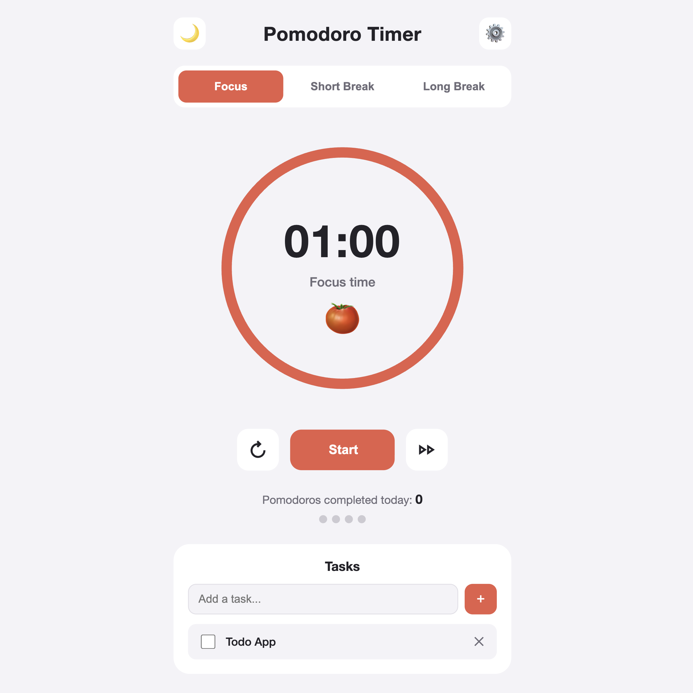

# Pomodoro Timer

A simple Pomodoro timer made just for fun and as a small GitHub project.
It is built with plain HTML, CSS, and JavaScript, with no frameworks, dependencies, or backend, so it can be easily hosted on GitHub Pages.

The application helps organize focused work sessions and breaks using the Pomodoro Technique. Settings, tasks, theme preferences, and daily progress are stored locally in the browser.

## Features

- Focus, short break, and long break modes
- Start, pause, reset, and skip controls
- Circular timer progress indicator
- Custom focus and break durations
- Configurable number of Pomodoros before a long break
- Optional automatic start of the next session
- Sound notifications when a session is completed
- Browser notifications
- Daily completed Pomodoro counter
- Pomodoro cycle progress indicators
- Built-in task list
  - Add tasks
  - Mark tasks as completed
  - Delete tasks
- Light and dark themes
- Automatic system theme detection
- Settings, tasks, progress, and theme saved in `localStorage`
- Responsive layout

## Technologies

- HTML5
- CSS3
- JavaScript
- Web Audio API
- Notifications API
- Web Storage API (`localStorage`)

## How to Use

1. Select **Focus**, **Short Break**, or **Long Break**.
2. Press **Start** to begin the timer.
3. Use the reset or skip buttons when needed.
4. Open **Settings** to configure:
   - Focus duration
   - Short break duration
   - Long break duration
   - Number of Pomodoros before a long break
   - Automatic start of the next session
   - Sound notifications
5. Add tasks in the **Tasks** section and mark them as completed while you work.
6. Use the theme button to switch between light and dark mode.

## Default Settings

| Setting | Default |
|---|---:|
| Focus | 25 min |
| Short break | 5 min |
| Long break | 15 min |
| Pomodoros before long break | 4 |
| Auto-start | Off |
| Sound | On |

## Data Storage

The application uses `localStorage` to save:

- Timer settings
- Tasks
- Daily completed Pomodoro count
- Selected theme

No backend, account, or database is required.

## Screenshot

## License

This project is licensed under the MIT License.